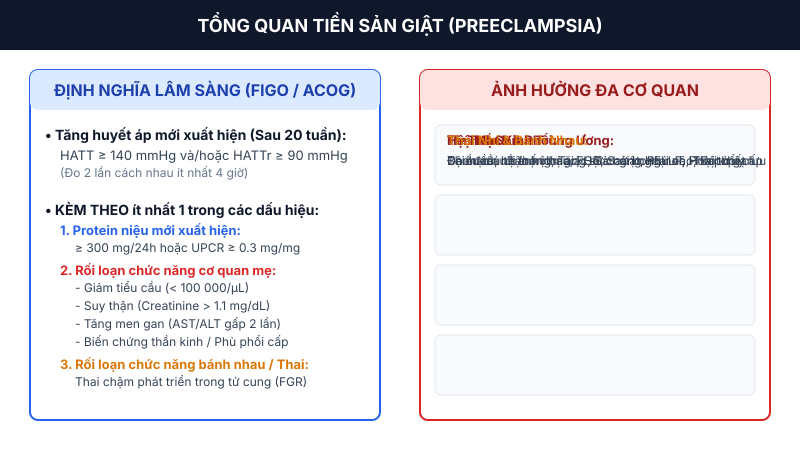
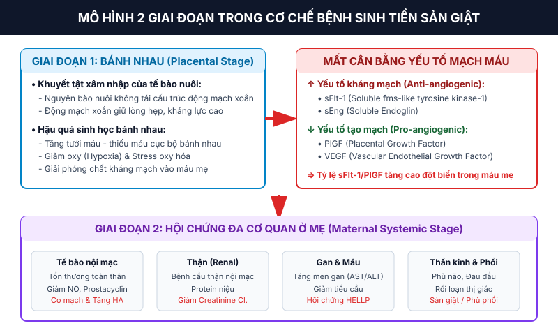
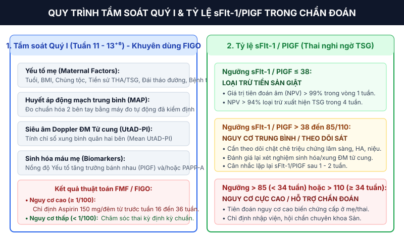
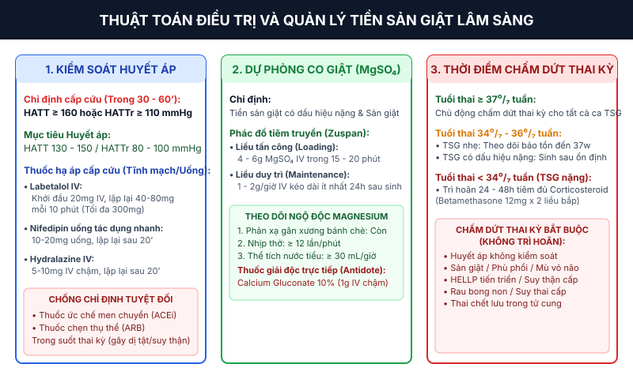

Tiền sản giật (_Preeclampsia_) là một rối loạn đa cơ quan phức tạp liên quan đến thai kỳ, đại diện cho một trong những nguyên nhân hàng đầu gây tử vong và tật bệnh nghiêm trọng ở thai phụ cũng như thai nhi trên phạm vi toàn cầu.[^1][^2]

_Hình "Tổng quan về tiền sản giật: Định nghĩa và ảnh hưởng đa cơ quan đối với mẹ và thai nhi"_. Nguồn: FIGO (2019) & AHA Circulation (2024).

## Tổng quan

### Định nghĩa hiện đại

Theo Hướng dẫn của Sáng kiến FIGO (_FIGO Initiative_) và Trường Môn Phụ Sản Hoa Kỳ (_ACOG_), tiền sản giật được định nghĩa là tình trạng **tăng huyết áp mới xuất hiện từ tuần thứ 20 của thai kỳ** (Huyết áp tâm thu **≥ 140 mmHg** và/hoặc Huyết áp tâm trương **≥ 90 mmHg** đo 2 lần cách nhau ít nhất 4 giờ) ở phụ nữ trước đó có huyết áp bình thường, kèm theo ít nhất một trong các dấu hiệu sau:[^1][^3]

- **Protein niệu mới xuất hiện:** Protein niệu 24 giờ **≥ 300 mg**; hoặc tỷ lệ Protein/Creatinine niệu (UPCR) **≥ 0.3 mg/mg** (**≥ 30 mg/mmol**); hoặc định lượng bằng que thử nhanh **≥ 2+** (chỉ áp dụng khi không có sẵn phương pháp định lượng).
- **Rối loạn chức năng cơ quan mẹ:**
  - **Huyết học:** Giảm tiểu cầu (số lượng tiểu cầu **< 100 000/µL**).
  - **Suy thận:** Nồng độ Creatinine huyết thanh **> 1.1 mg/dL** (**> 97.2 µmol/L**) hoặc tăng gấp đôi nồng độ Creatinine huyết thanh cơ bản khi không có bệnh lý thận khác.
  - **Tổn thương gan:** Men gan Transaminase (AST hoặc ALT) tăng **≥ 2 lần** so với giới hạn trên của mức bình thường, hoặc đau dữ dội vùng hạ sườn phải/thượng vị không giải thích được.
  - **Biến chứng thần kinh:** Đau đầu kéo dài không đáp ứng với thuốc giảm đau thông thường, rối loạn thị giác (nhìn mờ, ám điểm, đốm sáng, mù vỏ não), tăng phản xạ gân xương kèm giật cơ, hoặc đột quỵ.
  - **Phù phổi:** Phù phổi cấp xác định trên lâm sàng và X-quang.
- **Rối loạn chức năng bánh nhau / Thai nhi:** Thai chậm phát triển trong tử cung (_Fetal Growth Restriction_ - FGR), siêu âm Doppler động mạch rốn bất thường (mất hoặc đảo ngược sóng tâm trương - AEDN/REDN), hoặc thai chết lưu trong tử cung.[^1][^2]

:::note
Điểm khác biệt quan trọng trong định nghĩa hiện đại của ACOG và FIGO là **Protein niệu không còn là tiêu chuẩn bắt buộc** để chẩn đoán tiền sản giật nếu đã xuất hiện tăng huyết áp kèm theo bất kỳ rối loạn chức năng cơ quan mẹ hoặc suy chức năng bánh nhau/thai nhi.[^1][^3]
:::

### Dịch tễ học và Tầm quan trọng lâm sàng

- **Tần suất mắc bệnh:** Tiền sản giật ảnh hưởng đến khoảng **2 - 8%** tổng số thai kỳ trên toàn thế giới.[^1][^2]
- **Tử vong và tật bệnh ở mẹ:** Chiếm khoảng **10 - 15%** tổng số trường hợp tử vong mẹ trực tiếp liên quan đến thai kỳ (tương đương hơn 46 000 ca tử vong mẹ mỗi năm trên toàn cầu, phần lớn tập trung ở các nước có thu nhập thấp và trung bình). Biến chứng nguy hiểm bao gồm sản giật, xuất huyết não, hội chứng HELLP, vỡ gan và suy đa cơ quan.[^2][^4]
- **Gánh nặng cho thai nhi và sơ sinh:** Tiền sản giật là nguyên nhân trực tiếp gây ra khoảng **25%** các trường hợp thai chậm phát triển trong tử cung (FGR) và **20%** các trường hợp sinh non do chỉ định y khoa. Sinh non gây gia tăng đáng kể tỷ lệ tử vong sơ sinh, hội chứng suy hô hấp cấp (RDS), xuất huyết não thất và di chứng thần kinh lâu dài.[^1][^2]

## Yếu tố nguy cơ

Việc phân loại yếu tố nguy cơ ngay từ lần khám thai đầu tiên (quý I) có vai trò quyết định trong việc thiết lập chiến lược tầm soát và chỉ định dự phòng nguyên phát.[^1]

_Bảng "Phân loại các yếu tố nguy cơ của Tiền sản giật". Nguồn: FIGO (2019) & ACOG Practice Bulletin No. 202_.[^1][^3]

| Mức độ nguy cơ         | Yếu tố nguy cơ lâm sàng                                                                                                                                                                                                                                                                                                                                                             |
| :--------------------- | :---------------------------------------------------------------------------------------------------------------------------------------------------------------------------------------------------------------------------------------------------------------------------------------------------------------------------------------------------------------------------------- |
| **Nguy cơ cao**        | • Tiền sử tiền sản giật ở các thai kỳ trước. • Đa thai (song thai, tam thai...). • Tăng huyết áp mạn tính. • Đái tháo đường týp 1 hoặc týp 2. • Bệnh thận mạn tính. • Bệnh tự miễn (Hội chứng kháng Phospholipid, Lupus ban đỏ hệ thống).                                                                                                                  |
| **Nguy cơ trung bình** | • Mang thai con so (Chưa sinh con lần nào). • Béo phì trước thai kỳ (BMI **≥ 30 kg/m²**). • Tiền sử gia đình có mẹ hoặc chị em gái bị tiền sản giật. • Tuổi mẹ **≥ 35 tuổi**. • Khoảng cách giữa 2 lần mang thai **> 10 năm**. • Tiền sử thai nhỏ so với tuổi thai hoặc kết cục thai kỳ bất lợi. • Hỗ trợ sinh sản (Thụ tinh trong ống nghiệm - IVF). |

## Tầm soát Quý I

Khuyến cáo FIGO 2019 đề xuất chiến lược tầm soát diện rộng cho tất cả thai phụ vào giai đoạn **11 - 13⁺⁶ tuần thai** sử dụng thuật toán phối hợp (Triple Test của Quỹ Y học Thai nhi - FMF):[^1]

- **Các chỉ số tầm soát phối hợp:**
  - **Yếu tố nhân trắc và tiền sử mẹ:** Tuổi, BMI, chủng tộc, tiền sử sinh sản và bệnh lý đi kèm.
  - **Huyết áp động mạch trung bình (MAP):** Đo huyết áp chuẩn hóa ở cả hai tay bằng máy đo tự động đã được kiểm định. MAP được tính bằng công thức: MAP = Huyết áp tâm trương + 1/3 × (Huyết áp tâm thu - Huyết áp tâm trương).
  - **Chỉ số xung động mạch tử cung (UtAD-PI):** Đo bằng siêu âm Doppler màu ngả âm đạo hoặc ngả bụng, tính giá trị trung bình chỉ số xung của hai bên động mạch tử cung (Mean UtAD-PI).
  - **Biomarkers sinh hóa máu mẹ:** Định lượng nồng độ Yếu tố tăng trưởng bánh nhau (_Placental Growth Factor_ - PlGF) và/hoặc Protein A huyết tương gắn thai kỳ (_Pregnancy-Associated Plasma Protein A_ - PAPP-A) trong máu mẹ.
- **Hiệu quả tầm soát:** Mô hình phối hợp này phát hiện được khoảng **90%** các trường hợp tiền sản giật khởi phát sớm (< 34 tuần), **75%** trường hợp tiền sản giật khởi phát preterm (< 37 tuần) và **47%** trường hợp tiền sản giật khởi phát muộn (≥ 37 tuần) với tỷ lệ dương tính giả **10%**.[^1]

## Bệnh sinh

Cơ chế bệnh sinh của tiền sản giật hiện nay được thống nhất theo **Mô hình 2 giai đoạn** (_Two-stage model_) diễn tiến từ bất thường phát triển bánh nhau đến hội chứng đáp ứng viêm toàn thân ở người mẹ.[^2]

_Hình "Mô hình 2 giai đoạn và sự mất cân bằng các yếu tố mạch máu trong cơ chế bệnh sinh của tiền sản giật"_. Nguồn: AHA Circulation (2024).

### Giai đoạn 1: Bệnh lý mạch máu bánh nhau (Placental Stage)

1. **Khuyết tật tái cấu trúc động mạch xoắn:**
   - Trong thai kỳ bình thường, các tế bào nguyên bào nuôi ngoài gai nhau (_extravillous trophoblasts_ - EVT) xâm nhập vào lớp cơ tử cung, phá hủy lớp nội mạc và cơ chun của các động mạch xoắn, biến đổi chúng từ các mạch máu nhỏ, cuộn xoắn, kháng lực cao thành các ống dẫn máu lớn, giãn rộng, không có phản ứng co mạch và kháng lực thấp để đảm bảo cung cấp đủ lượng máu tưới cho thai nhi.
   - Trong tiền sản giật, quá trình xâm nhập của nguyên bào nuôi bị khiếm khuyết nặng nề (chỉ xâm nhập nông ở phần màng đệm mà không vào tới tầng cơ tử cung). Kết quả là các động mạch xoắn giữ nguyên cấu trúc ống hẹp, thành dày và kháng lực cao.[^2]
2. **Thiếu máu cục bộ và Stress oxy hóa bánh nhau:**
   - Sự tưới máu bánh nhau không đầy đủ dẫn đến tình trạng giảm oxy (_hypoxia_), giảm tưới máu xen kẽ với đợt tái tưới máu (_ischemia-reperfusion injury_), tạo ra stress oxy hóa nghiêm trọng tại mô bánh nhau và giải phóng các mảnh vi thể tế bào đệm, cytokine viêm cùng các yếu tố kháng mạch vào tuần hoàn mẹ.[^1][^2]

### Giai đoạn 2: Mất cân bằng Angiogenic và Hội chứng đa cơ quan (Maternal Stage)

1. **Sự gia tăng các yếu tố kháng mạch (Anti-angiogenic factors):**
   - Bánh nhau bị thiếu máu tiết ra một lượng lớn **sFlt-1** (_Soluble fms-like tyrosine kinase-1_) và **sEng** (_Soluble Endoglin_) vào máu mẹ.
   - sFlt-1 đóng vai trò như một thụ thể bẫy, gắn và trung hòa các yếu tố tăng trưởng nội mạc mạch máu tự do trong tuần hoàn bao gồm **PlGF** (_Placental Growth Factor_) và **VEGF** (_Vascular Endothelial Growth Factor_).
   - sEng ức chế con đường tín hiệu của TGF-β, làm trầm trọng thêm tình trạng co mạch và tổn thương nội mạc.[^2][^4]
2. **Tổn thương tế bào nội mạc lan tỏa và rối loạn đa cơ quan:**
   - Sự sụt giảm PlGF và VEGF tự do dẫn đến mất khả năng duy trì sức khỏe cấu trúc nội mạc toàn thân mẹ.
   - **Thận:** Gây bệnh cầu thận nội mạc (_glomerular endotheliosis_), làm rò rỉ đạm vào nước tiểu (Protein niệu) và giảm mức lọc cầu thận.
   - **Mạch máu:** Giảm tổng hợp Nitric Oxide (NO) và Prostacyclin ($PGI_2$), tăng tiết Thromboxane $A_2$ ($TXA_2$) và Endothelin-1, dẫn đến co mạch hệ thống, tăng sức cản ngoại vi và gây tăng huyết áp nghiêm trọng.
   - **Gan:** Tổn thương vi mạch gan gây hoại tử tế bào gan nhu mô, sưng bọc Glisson (gây đau hạ sườn phải) và hội chứng HELLP.
   - **Não:** Rối loạn tự điều hòa tuần hoàn, phá vỡ hàng rào máu - não gây phù não, co giật (Sản giật) và xuất huyết não.[^2][^4]

## Phân loại

Tiền sản giật được phân loại dựa trên thời điểm khởi phát lâm sàng và mức độ nghiêm trọng của bệnh.[^1][^3]

### Phân loại theo thời điểm khởi phát

- **Tiền sản giật khởi phát sớm (_Early-onset preeclampsia_):** Xuất hiện **< 34 tuần thai**. Thường liên quan chặt chẽ đến bất thường tái cấu trúc bánh nhau nặng, thai chậm phát triển trong tử cung (FGR) và tỷ lệ biến chứng nặng ở mẹ/thai cao.
- **Tiền sản giật khởi phát muộn (_Late-onset preeclampsia_):** Xuất hiện **≥ 34 tuần thai** (chiếm **80 - 85%** tổng số ca). Thường liên quan đến sự yếu kém của yếu tố chuyển hóa ở mẹ hoặc sự già hóa bánh nhau đơn thuần; thai nhi thường có kích thước bình thường hoặc lớn.[^1]

### Phân loại theo mức độ lâm sàng

- **Tiền sản giật không có dấu hiệu nặng:** Tăng huyết áp kèm Protein niệu nhưng không có các dấu hiệu tổn thương cơ quan đích.
- **Tiền sản giật có dấu hiệu nặng (_Preeclampsia with severe features_):** Chẩn đoán khi có tiền sản giật kèm theo ít nhất một trong các tiêu chuẩn sau:[^3][^4]
  - Huyết áp tâm thu **≥ 160 mmHg** hoặc Huyết áp tâm trương **≥ 110 mmHg** (đo 2 lần cách nhau ít nhất 15 phút khi bệnh nhân nghỉ ngơi).
  - Giảm tiểu cầu (< 100 000/µL).
  - Suy chức năng gan (AST/ALT tăng gấp 2 lần giới hạn trên, hoặc đau kéo dài vùng hạ sườn phải/thượng vị).
  - Suy thận tiến triển (Creatinine huyết thanh > 1.1 mg/dL hoặc tăng gấp đôi).
  - Phù phổi cấp.
  - Các triệu chứng thần kinh hoặc thị giác mới xuất hiện (đau đầu dữ dội, mờ mắt, ám điểm).

:::caution
Mức độ Protein niệu **không còn được sử dụng** để phân loại tiền sản giật nặng hay nhẹ. Ngay cả khi Protein niệu rất cao (> 5 g/24h), nếu không có các dấu hiệu tổn thương cơ quan đích khác thì không tự động xếp loại là tiền sản giật có dấu hiệu nặng.[^3]
:::

## Chẩn đoán

_Hình "Sơ đồ tầm soát quý I và vai trò của tỷ lệ sFlt-1/PlGF trong đánh giá nguy cơ tiền sản giật"_. Nguồn: FIGO (2019) & AJOG (2021).

### Tiêu chuẩn chẩn đoán xác định

Chẩn đoán xác định tiền sản giật đòi hỏi sự hiện diện của:[^1][^3]

1. **Tăng huyết áp:** Huyết áp tâm thu **≥ 140 mmHg** hoặc tâm trương **≥ 90 mmHg** xuất hiện sau tuần thứ 20 thai kỳ ở người có huyết áp bình thường trước đó.
2. **Kèm theo ít nhất một trong các tiêu chí:** Protein niệu, Giảm tiểu cầu, Suy thận, Tăng men gan, Phù phổi, Triệu chứng thần kinh/thị giác, hoặc Suy chức năng bánh nhau/thai nhi.

### Tỷ lệ sFlt-1/PlGF trong chẩn đoán và tiên đoán

Đo nồng độ sFlt-1 và PlGF trong huyết thanh mẹ có giá trị lâm sàng lớn trong việc tiên đoán và loại trừ tiền sản giật ở các thai phụ nghi ngờ (dựa trên các thử nghiệm lâm sàng lớn như PROGNOSIS và PROMISS):[^1]

- **Tỷ lệ sFlt-1/PlGF ≤ 38 (Loại trừ):** Cho phép **loại trừ** khả năng phát triển tiền sản giật trong vòng 1 tuần với Giá trị tiên đoán âm (_Negative Predictive Value_ - NPV) đạt **99.3%**, và loại trừ trong vòng 4 tuần với NPV đạt **94.3%**. Giúp tránh chỉ định nhập viện theo dõi không cần thiết.[^1]
- **Tỷ lệ sFlt-1/PlGF > 38:** Chỉ ra nguy cơ gia tăng. Cần được theo dõi sát và đánh giá lại sau 1 - 2 tuần.
- **Tỷ lệ sFlt-1/PlGF > 85 (khi thai < 34 tuần) hoặc > 110 (khi thai ≥ 34 tuần) (Khẳng định nguy cơ cao):** Giá trị tiên đoán dương (_PPV_) đạt hơn 80% đối với biến chứng bất lợi. Tiên đoán nguy cơ rất cao xuất hiện các biến chứng nặng ở mẹ và thai nhi trong vòng 4 tuần; hỗ trợ khẳng định chẩn đoán tiền sản giật trong các trường hợp lâm sàng phức tạp (như bệnh thận mạn hoặc tăng huyết áp mạn tính).[^1]

### Các vấn đề liên quan đến chẩn đoán phân biệt

- **Tăng huyết áp mạn tính ghép Tiền sản giật (_Superimposed Preeclampsia_):** Chẩn đoán ở phụ nữ đã có tiền sử tăng huyết áp mạn tính khi xuất hiện:[^3][^4]
  - Tăng huyết áp bùng phát đột ngột khó kiểm soát.
  - Mới xuất hiện Protein niệu hoặc Protein niệu tăng vọt đột ngột.
  - Mới xuất hiện giảm tiểu cầu, tăng men gan, suy thận hoặc triệu chứng thần kinh.
- **Hội chứng HELLP:** Thể lâm sàng đặc biệt nghiêm trọng của tiền sản giật bao gồm Tán huyết vi mạch (_Hemolysis_ - LDH > 600 U/L, schizocytes trên tiêu bản máu ngoại vi, Bilirubin toàn phần > 1.2 mg/dL), Tăng men gan (_Elevated Liver enzymes_ - AST hoặc ALT ≥ 70 U/L) và Giảm tiểu cầu (_Low Platelets_ < 100 000/µL).
  - _Phân loại Mississippi (3 mức độ):_ Độ 1 (Tiểu cầu < 50 000/µL - nặng nhất), Độ 2 (Tiểu cầu 50 000 - 100 000/µL), Độ 3 (Tiểu cầu 100 000 - 150 000/µL).
  - _Phân loại Tennessee:_ HELLP hoàn toàn (đủ cả 3 tiêu chuẩn) vs HELLP không hoàn toàn (chỉ có 1 - 2 tiêu chuẩn).
- **Tăng huyết áp thai kỳ (_Gestational Hypertension_):** Tăng huyết áp mới xuất hiện sau tuần 20 nhưng **không có** Protein niệu và **không có** tổn thương cơ quan đích. Nếu tình trạng này kéo dài quá 12 tuần sau sinh thì chẩn đoán trở thành Tăng huyết áp mạn tính.

## Điều trị

_Hình "Thuật toán kiểm soát huyết áp, dự phòng co giật MgSO₄ và quyết định thời điểm chấm dứt thai kỳ"_. Nguồn: AJOG (2021) & Medscape (2022).

### Nguyên tắc điều trị chung

- **Chấm dứt thai kỳ là phương pháp điều trị triệt để duy nhất** đối với tiền sản giật.[^1][^3]
- Tất cả các biện pháp điều trị nội khoa (hạ áp, dự phòng co giật) chỉ nhằm mục đích kéo dài thai kỳ một cách an toàn để thai nhi đạt độ trưởng thành tối ưu hoặc chuẩn bị tốt nhất cho cuộc chuyển dạ/mẫu lấy thai.[^3][^4]

### Kiểm soát Huyết áp Cấp cứu

Chỉ định điều trị hạ áp khẩn cấp trong vòng **30 - 60 phút** khi Huyết áp tâm thu **≥ 160 mmHg** và/hoặc Huyết áp tâm trương **≥ 110 mmHg** để phòng ngừa biến chứng xuất huyết não và tử vong mẹ.[^3][^4]

- **Mục tiêu huyết áp:** Duy trì Huyết áp tâm thu **130 - 150 mmHg** và Huyết áp tâm trương **80 - 100 mmHg** (không hạ huyết áp quá nhanh hoặc quá thấp vì có thể làm giảm tưới máu bánh nhau gây suy thai cấp).
- **Phác đồ điều trị cấp cứu cụ thể:**
  - **_Labetalol_ (Tiêm tĩnh mạch):**
    - Liều 1: Tiêm tĩnh mạch chậm **20 mg** trong 2 phút. Đánh giá lại huyết áp sau 10 phút.
    - Liều 2: Nếu HA vẫn cao, tiêm **40 mg**. Đánh giá lại sau 10 phút.
    - Liều 3: Nếu HA vẫn cao, tiêm **80 mg**. Đánh giá lại sau 10 phút (Liều tối đa tích lũy tiêm tĩnh mạch là **300 mg**).
    - Hoặc chuyển sang truyền tĩnh mạch liên tục **1 - 2 mg/phút**.
  - **_Nifedipin_ tác dụng nhanh (Uống):**
    - Liều 1: Uống **10 - 20 mg** (không nhai/ngậm). Đánh giá lại sau 20 phút.
    - Liều 2: Nếu HA vẫn cao, uống **20 mg**. Đánh giá lại sau 20 phút.
    - Liều 3: Nếu HA vẫn cao, uống **20 mg**. Chuyển sang _Labetalol_ tiêm tĩnh mạch nếu chưa đáp ứng.
  - **_Hydralazine_ (Tiêm tĩnh mạch):**
    - Liều 1: Tiêm tĩnh mạch chậm **5 - 10 mg** trong 2 phút. Đánh giá lại sau 20 phút.
    - Liều 2: Nếu HA vẫn cao, tiêm **10 mg**. Đánh giá lại sau 20 phút (Liều tối đa tích lũy **20 mg**).
- **Điều trị duy trì bằng đường uống:**
  - _Labetalol_: **100 - 400 mg** x 2 - 3 lần/ngày (tối đa **2400 mg/ngày**).
  - _Nifedipin_ phóng thích kéo dài (Retard/Chrono): **30 - 60 mg** x 1 - 2 lần/ngày (tối đa **120 mg/ngày**).
  - _Methyldopa_: **250 - 500 mg** x 2 - 4 lần/ngày (tối đa **3000 mg/ngày**).

:::danger
**CHỐNG CHỈ ĐỊNH TUYỆT ĐỐI:** Các thuốc Thuốc ức chế men chuyển (ACEi), Thuốc chẹn thụ thể Angiotensin II (ARB) và Thuốc ức chế Renin trực tiếp vì gây dị tật bẩm sinh nghiêm trọng, vô niệu, suy thận và tử vong thai nhi.[^3][^4]
:::

### Dự phòng co giật bằng Magnesium Sulfate ($MgSO_4$)

_Magnesium sulfate_ là thuốc lựa chọn hàng đầu trong dự phòng và điều trị co giật do Sản giật (hiệu quả vượt trội hơn so với _diazepam_ hay _phenytoin_).[^3][^4]

- **Chỉ định:** Tất cả thai phụ Tiền sản giật có dấu hiệu nặng, hoặc đang trong quá trình chuyển dạ/mẫu lấy thai, hoặc người đã xảy ra co giật Sản giật.[^3]
- **Phác đồ đường tĩnh mạch (Zuspan scheme):**
  - **Liều tấn công (Loading dose):** **4 - 6 g** _magnesium sulfate_ 20% (hoặc 50%) pha trong 100 mL dung dịch $NaCl$ 0.9% truyền tĩnh mạch trong **15 - 20 phút**.
  - **Liều duy trì (Maintenance dose):** Truyền tĩnh mạch liên tục **1 - 2 g/giờ** trong suốt quá trình chuyển dạ và kéo dài ít nhất **24 giờ sau sinh** (hoặc 24 giờ sau cơn co giật cuối cùng).
- **Phác đồ đường tiêm bắp (Pritchard scheme - Áp dụng khi không có máy truyền dịch):**
  - **Liều tấn công:** **4 g** IV truyền chậm + **10 g** IM (5 g tiêm bắp sâu ở mỗi bên mông).
  - **Liều duy trì:** **5 g** IM mỗi 4 giờ vào luân phiên hai bên mông.
- **Theo dõi ngộ độc Magnesium (Bắt buộc kiểm tra mỗi 1 - 2 giờ):**
  - **Phản xạ gân xương bánh chè:** Phải còn hiện diện (mất phản xạ gân xương xảy ra khi nồng độ Mg²⁺ máu đạt **4 - 5 mmol/L**).
  - **Nhịp thở:** Phải **≥ 12 lần/phút** (ức chế hô hấp xảy ra khi Mg²⁺ đạt **6 - 7 mmol/L**).
  - **Thể tích nước tiểu:** Phải **≥ 30 mL/giờ** (hoặc **≥ 100 mL/4 giờ**) vì _magnesium_ đào thải chủ yếu qua thận.
- **Xử trí ngộ độc Magnesium:**
  - Ngưng truyền _magnesium sulfate_ ngay lập tức khi có dấu hiệu ngộ độc.
  - Tiêm tĩnh mạch chậm **1 g Calcium Gluconate 10%** (10 mL) trong **3 - 5 phút** (thuốc đối kháng giải độc trực tiếp).
  - Hỗ trợ thông khí/thở oxygen nếu có suy hô hấp.[^4]

### Liệu pháp Corticosteroid trưởng thành phổi

- **Chỉ định:** Cho tất cả thai phụ tiền sản giật có tuổi thai từ **24⁰/₇ đến 33⁶/₇ tuần** (và cân nhắc ở tuổi thai 34⁰/₇ đến 36⁶/₇ tuần nếu chưa dùng trước đó và có chỉ định chấm dứt thai kỳ trong vòng 7 ngày).[^3]
- **Phác đồ:**
  - **_Betamethasone_:** **12 mg** tiêm bắp, 2 liều cách nhau 24 giờ.
  - HOẶC **_Dexamethasone_:** **6 mg** tiêm bắp, 4 liều cách nhau 12 giờ.

### Quyết định Thời điểm Chấm dứt thai kỳ

Chấm dứt thai kỳ được quyết định dựa trên tuổi thai và độ nặng của bệnh:[^1][^3]

- **Tuổi thai ≥ 37⁰/₇ tuần:** Chỉ định chấm dứt thai kỳ chủ động cho **tất cả** các trường hợp tiền sản giật (kể cả không có dấu hiệu nặng).
- **Tuổi thai 34⁰/₇ đến 36⁶/₇ tuần:**
  - _Tiền sản giật không có dấu hiệu nặng:_ Có thể theo dõi bảo tồn đến 37 tuần nếu điều kiện mẹ và thai ổn định.
  - _Tiền sản giật có dấu hiệu nặng:_ Chỉ định chấm dứt thai kỳ sau khi đã hội chẩn và ổn định tình trạng mẹ.
- **Tuổi thai < 34⁰/₇ tuần (Tiền sản giật có dấu hiệu nặng):**
  - Quản lý bảo tồn trì hoãn trong **24 - 48 giờ** tại trung tâm sản khoa tuyến cuối để tiêm đủ liều Corticosteroid trưởng thành phổi nếu tình trạng mẹ và thai ổn định.
  - **Chỉ định chấm dứt thai kỳ BẮT BUỘC KHÔNG TRÌ HOÃN (dù ở bất kỳ tuổi thai nào):**
    - Huyết áp nghiêm trọng không kiểm soát được dù đã dùng 3 nhóm thuốc hạ áp.
    - Sản giật hoặc các triệu chứng thần kinh tiến triển (mù vỏ não, xuất huyết não).
    - Phù phổi cấp.
    - Nhồi máu cơ tim hoặc rối loạn chức năng tim.
    - Hội chứng HELLP tiến triển hoặc Suy thận cấp tiến triển (Creatinine tăng gấp đôi).
    - Rau bong non hoặc Đông máu rải rác trong lòng mạch (DIC).
    - Suy thai cấp (CTG Nhóm III, Doppler động mạch rốn mất/đảo ngược sóng tâm trương - AEDN/REDN, hoặc BPP ≤ 4).
    - Thai chết lưu trong tử cung.[^3][^4]

## Theo dõi

### Theo dõi trong giai đoạn Hậu sản

- **Nguy cơ tiền sản giật muộn/sau sinh:** Khoảng **30%** các ca sản giật và nhiều trường hợp tiền sản giật nặng xuất hiện trong giai đoạn hậu sản (đặc biệt trong vòng 48 giờ đầu và kéo dài đến 6 tuần sau sinh).[^3][^4]
- **Kiểm soát huyết áp hậu sản:** Tiếp tục theo dõi huyết áp ít nhất 4 lần/ngày trong thời gian nằm viện và hướng dẫn bệnh nhân tự đo tại nhà. Tiếp tục dùng thuốc hạ áp nếu huyết áp còn cao và giảm liều dần.
- Bệnh nhân cần tái khám ngay nếu xuất hiện đau đầu, rối loạn thị giác, đau thượng vị hoặc huyết áp **≥ 150/100 mmHg**.[^4]

## Dự phòng

### Dự phòng bằng Aspirin liều thấp

Sử dụng _aspirin_ liều thấp là biện pháp duy nhất đã được chứng minh có hiệu quả rõ rệt trong dự phòng cấp 1 tiền sản giật ở nhóm đối tượng có nguy cơ.[^1][^3]

- **Chỉ định:** Dành cho thai phụ thuộc nhóm **Nguy cơ cao** (chỉ cần 1 yếu tố) hoặc nhóm **Nguy cơ trung bình** (khi có từ 2 yếu tố trở lên), hoặc thai phụ có kết quả tầm soát Quý I nguy cơ cao (Risk **≥ 1/100**).[^1]
- **Liều dùng & Khuyến cáo giữa các Hướng dẫn:**
  - **FIGO 2019:** Khuyến cáo liều **150 mg/ngày** uống vào buổi tối (trước khi đi ngủ) để đạt hiệu quả ức chế Thromboxane $A_2$ tối ưu và giảm tỷ lệ kháng aspirin trong thai kỳ.[^1]
  - **ACOG / USPSTF:** Khuyến cáo liều **81 mg/ngày** (hoặc 75 - 100 mg/ngày tại các quốc gia châu Âu).
- **Thời điểm bắt đầu:** Bắt đầu từ tuần thứ **12 - 16 của thai kỳ** (tốt nhất là trước 16 tuần thai) và kéo dài liên tục đến tuần thứ **36 của thai kỳ** hoặc đến khi sinh.[^1][^3]

### Bổ sung Calcium

- **Chỉ định:** Cho thai phụ sinh sống ở các vùng có khẩu phần ăn thiếu hụt Calcium (< 800 mg/ngày).
- **Liều dùng:** Bổ sung **1.5 - 2.0 g Calcium nguyên tố/ngày** chia làm 3 lần uống cùng bữa ăn.[^1]

## Biến chứng lâu dài

Tuyên bố khoa học của Hiệp hội Tim mạch Hoa Kỳ (_AHA Circulation 2024_) nhấn mạnh tiền sản giật không chỉ là bệnh lý ngắn hạn trong thai kỳ mà còn là một **yếu tố nguy cơ độc lập mạnh mẽ của bệnh lý tim mạch và chuyển hóa trong suốt cuộc đời người mẹ**.[^2]

_Bảng "Nguy cơ tim mạch lâu dài ở phụ nữ có tiền sử Tiền sản giật". Nguồn: AHA Circulation (2024)_.[^2]

| Biến chứng tim mạch lâu dài                    | Mức độ tăng nguy cơ (Relative Risk - RR)                                   |
| :--------------------------------------------- | :------------------------------------------------------------------------- |
| **Tăng huyết áp mạn tính**                     | Tăng nguy cơ gấp **3 - 4 lần** (xuất hiện trong vòng 5 - 10 năm sau sinh). |
| **Bệnh cơ tim thiếu máu / Mạch vành**          | Tăng nguy cơ gấp **2 lần**.                                                |
| **Đột quỵ (Stroke)**                           | Tăng nguy cơ gấp **2 - 3 lần**.                                            |
| **Suy tim (Heart Failure)**                    | Tăng nguy cơ gấp **4 lần**.                                                |
| **Suy thận mạn giai đoạn cuối (ESRD)**         | Tăng nguy cơ gấp **3 - 10 lần**.                                           |
| **Đái tháo đường týp 2 & Rối loạn chuyển hóa** | Tăng nguy cơ gấp **2 - 3 lần**.                                            |

:::tip Khuyến cáo Quản lý Tim mạch Lâu dài theo AHA
Tất cả phụ nữ có tiền sử tiền sản giật cần được ghi nhận thông tin này vào hồ sơ sức khỏe trọn đời. Khuyến cáo kiểm tra sức khỏe tim mạch định kỳ hàng năm (đo huyết áp, bilan lipid máu, đường huyết đói, chức năng thận) và duy trì lối sống lành mạnh (chế độ ăn DASH/Địa Trung Hải, tập thể dục, kiểm soát cân nặng).[^2]
:::

## Tài liệu tham khảo

1. Poon LC, Shennan A, Hyett JA, et al. The International Federation of Gynecology and Obstetrics (FIGO) initiative on gestational hypertension and preeclampsia: A pragmatic guide for first-trimester screening and prevention. _Int J Gynaecol Obstet_. 2019;145(S1):1-78. doi:10.1002/ijgo.12802
2. Garovic VD, Dechend R, Easterling T, et al. Hypertension in pregnancy: Diagnosis, blood pressure goals, and pharmacotherapy: A scientific statement from the American Heart Association. _Circulation_. 2022;145(10):e750-e767. doi:10.1161/CIR.0000000000001049
3. Gestational hypertension and preeclampsia: ACOG Practice Bulletin, Number 202. _Obstet Gynecol_. 2019;133(1):e1-e25. doi:10.1097/AOG.0000000000003018
4. Medscape Reference. Hypertension in pregnancy diagnosis & management. Medscape. Updated October 2022. Accessed January 15, 2024. https://reference.medscape.com/cc2/p10/hypertension-pregnancy-diagnosis-and-management-secondary-2022a10022fz
